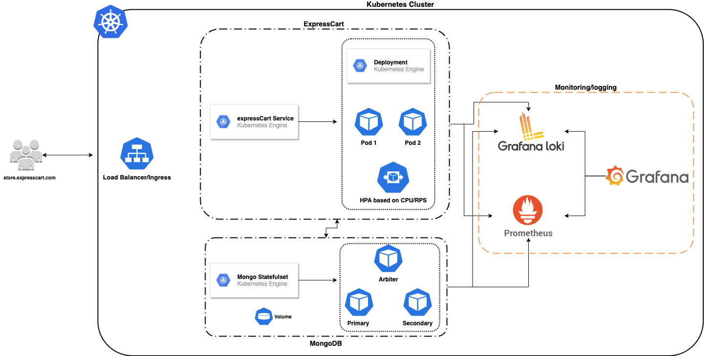

# Helm chart to deploy expressCart in Kubernetes

`expressCart` is a fully functional shopping cart built in Node.js (Express, MongoDB) with built in popular payment providers.

## Architecture:


## Requirements:
- Kubernetes 1.15+
- Helm v3
- Kubectl
- Docker

## Components:
- Nginx
- Cert-manager
- MongoDB
- ExpressCart application
- Prometheus
- Grafana
- Loki

## Setup:

### Build the docker image and push it to container registry
```bash
$ docker build -t <image_name> .
$ docker tag <image_name> <remote_image_name>
$ docker push <remote_image_name>
```

### Create namespace for ingress
```bash
kubectl create namespace ingress
```
### Create common namespace for expresscart and mongoDB deployments
```bash 
$ kubectl create namespace expresscart
```

### Add official helm repos for nginx, certmanager and mongodb
```bash
$ helm repo add jetstack https://charts.jetstack.io
$ helm repo add stable https://kubernetes-charts.storage.googleapis.com
$ helm repo add bitnami https://charts.bitnami.com/bitnami
$ helm repo update
```

### Deploy nginx-ingress
```bash
$ helm install ingress stable/nginx-ingress --set controller.metrics.enabled=true -n ingress
```

### Deploy cert-manager
```bash
$ kubectl create namespace cert-manager

$ kubectl apply --validate=false -f https://github.com/jetstack/cert-manager/releases/download/v0.15.0/cert-manager.crds.yaml

$ helm install \
  cert-manager jetstack/cert-manager \
  --namespace cert-manager \
  --version v0.15.0 \

$ kubectl apply -f cert-manager-issuer.yaml -n expresscart
```

### Deploy mongodb
```bash
$ helm install expresscart-mongodb bitnami/mongodb --set mongodbRootPassword=expressCart,persistence.size=15Gi -n expresscart
```

## ExpressCart helm chart deployment instructions:

- Open values.yaml in expressCart-chart folder and replace the `repository` with docker-image from image section
- Replace the `MONGODB_URI` from projectEnv section(if needed)
- Replace the `hosts` and `tls` with the actual domain which will be useful to access the application outside of the cluster with ssl enabled
- Install the chart with below command:

```bash
$ helm upgrade --force --install expressCart expressCart-chart -f expressCart-chart/values.yaml -n expresscart
```

## Monitoring and Logging

- We are using Prometheus/Grafana/Loki stack to aggregate logs and create metrics to track the application behaviour
- Prometheus - Used to extract and store all the metric data from applications and kubernetes components 
- Loki - Used to extract and aggregate all the application or container logs running inside kubernetes 
- Grafana - Used to visualize all the metric and log data that comes from prometheus and loki